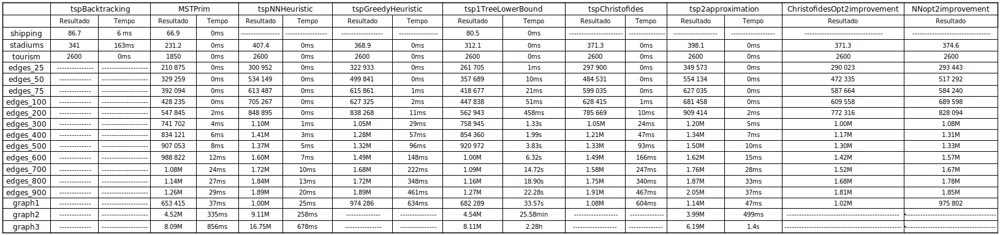

# Project 2 - Travelling Salesman Problem

<h3>Project made by:</h3>
<h6>Pedro Vidal Marcelino	- up202108754@up.pt</h6>
<h6>Jose Francisco Reis Pedreiras Neves Veiga		- up202108753@up.pt</h6>
<h6>Antonio Marujo Rama	  - up202108801@up.pt</h6>

This project was done for the Design of Algorithms curricular unit @ **FEUP - Faculdade de Engenharia da Universidade do Porto**.
It implements different algorithms and heuristics for solving the Traveling Salesman Problem (TSP) using C++ and provides a menu-based interface to interact with the algorithms and compare their performance on various graphs.

<h2>Algorithms Implemented</h2>
  
  **TSP Backtracking** - It gives the optimal solution, efficient for small graphs.
  
  **Kruskal and Prim** - Algorithms designed to find the Minimum Spanning Tree (MST) of the graph that help in other algorithms such as **Christofides** and Greedy Heuristics.
  
  **TSP 2 Approximation Heuristic** - Relies on the triangular inequality, guarantees a ratio of at most 2 times the optimal solution.
  
  **TSP Nearest Neighbor Heuristic** - Greedy heuristic which always chooses the next cheapest node to visit, similar to Prim's algorithm.
  
  **TSP Greedy Heuristic** - Another greedy heuristic which always chooses the cheapest edge, similar to Kruskal's algorithm. Implemented with a priority queue and used in complete graphs.
  
  **TSP 1 Tree Lower Bound** - Algorithm that calculates the largest MST with Prim after removing each node. Finds the best lower bound for the optimal solution.
  
  **Christofides Algorithm** - Maybe the best algorithm for finding an approximation for the optimal solution in an efficient way in complete graphs. Guarantees a ratio of at most 1.5 times the optimal solution.
  
  **TSP 2 Opt Improvement** - Algorithm that takes a TSP path as input and, using local search, keeps swapping pairs of nodes until it doesn't find a better path. Improves many of the above algorithms' solutions.
  
  **Other Functions** - Other functions implemented to parse the information given on the csv files, the **Haversine** function for finding the distance between two geographical locations, and other algorithms.
  
  <h2>Results</h2>
  
  
